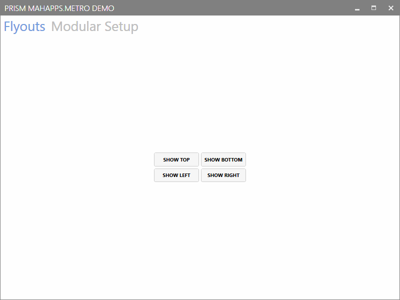
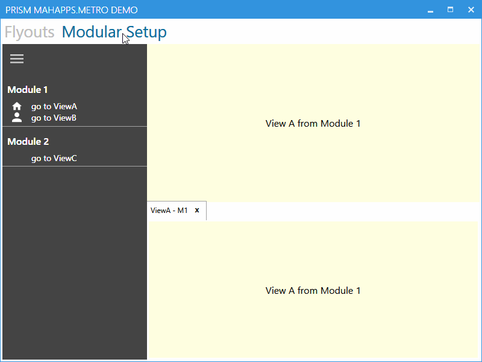

# MahAppsPrismDemo

Sample Application showing modular loosely coupled program setup with some cross-functionality features between 
[MahApps.Metro](https://github.com/MahApps/MahApps.Metro) and
[PrismLibrary](https://github.com/PrismLibrary/Prism)

Currently it demonstrates the following features/concepts:

1. Toggle (show/hide) Flyouts in a modular MVVM structured App, from everywhere in your app

2. Add/Remove a MahApps HamburgerMenu Entries from your Modules

3. Add/Remove Flyouts from your Modules

4. Use TabControl as HamburgerMenu Content 
(including ColseTabAction which removes the View also from its Prism Region)

## Flyouts

## Modular Setup

---

Based on Demo [MahAppsPrismRegionAdapters](https://github.com/WaldemarCoding/MahAppsPrismRegionAdapters)
